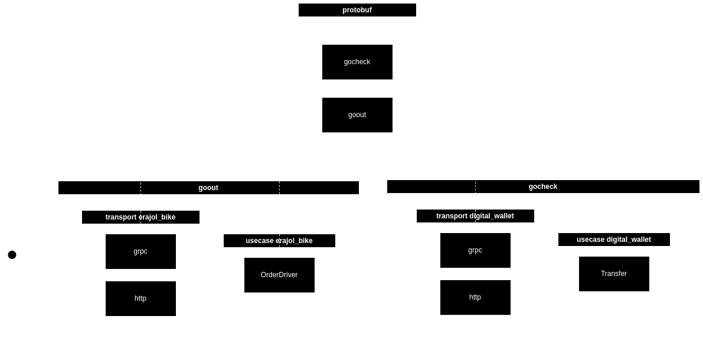

# goout
Checkout Team Go Code Convention.



# Code structure

```
├── internal/
│   ├── app/            Package app contains application starter.
│   ├── config/         Package config provides functionality for loading and accessing application configurations.
│   ├── dto/            Package dto provides data transfer objects (DTOs) for transferring data between different layers of the application.
│   ├── entity/         Package entity provides domain entities representing the core business objects.
│   ├── extapi/         Package extapi provides implementations for external APIs.
│   ├── repo/           Package repo provides repository implementations for data storage.
│   │   ├── cache/      Package cache provides cache storage implementations.
│   │   ├── db/         Package db provides database connection and management functionalities.
│   ├── transport/
│   │   ├── grpc/       Package grpc provides gRPC server implementation.
│   │   ├── http/       Package http provides HTTP server implementation.
│   ├── usecase/        Package usecase provides the business logic implementation.
├── pkg/
├── go.mod
├── go.sum
├── main.go
├── README.md
```
